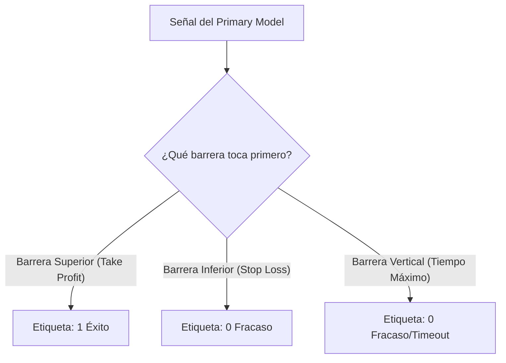
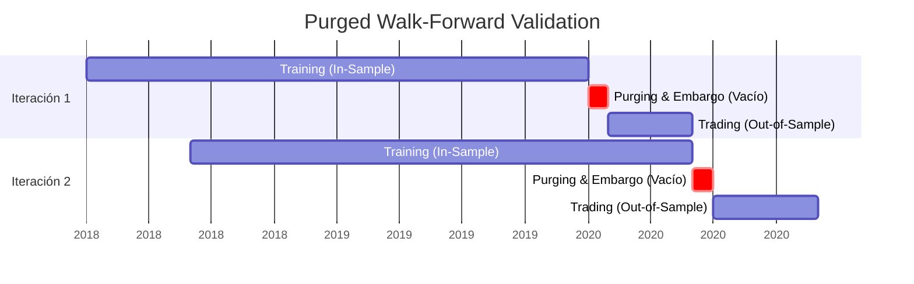

# Metodología Cuantitativa: El Framework M2

El Pipeline M2 no es un simple script de *Machine Learning*, sino una infraestructura institucional basada en la literatura científica más rigurosa de las finanzas cuantitativas. Este documento detalla los fundamentos matemáticos y arquitectónicos que previenen el *Overfitting* y el *Data Leakage*.

---

## 1. Meta-Labeling y el Método de la Triple Barrera

### El Paradigma Clásico vs Meta-Labeling
Tradicionalmente, los modelos de ML en finanzas intentan predecir la dirección del precio ($Y \in \{-1, 0, 1\}$). Este enfoque ("Primary Model") suele fallar porque el mercado es un sistema complejo y no estacionario.

Basado en la obra de **Marcos López de Prado (*Advances in Financial Machine Learning*, 2018)**, el Pipeline M2 implementa el **Meta-Labeling**. Separamos el problema en dos partes:
1. **Primary Model (MQL5):** Un algoritmo básico (ej. Hull Moving Average) emite una señal de entrada.
2. **Secondary Model (XGBoost):** Evalúa las condiciones del mercado y predice *exclusivamente* si esa señal será rentable o no ($Y \in \{0, 1\}$), actuando como un filtro de riesgo (Position Sizing).

### El Sacrificio de Rentabilidad (Alto Recall)
Durante el desarrollo del proyecto (especialmente en las fases previas al uso de StrategyQuant X), tomamos una decisión arquitectónica anti-intuitiva pero vital para el *Meta-Labeling*: **configuramos los bots primarios en MT5 para ser sumamente irrentables y poco restrictivos.** 

El objetivo del modelo primario *no es tener alta precisión*, sino un alto **Recall** (alta frecuencia de disparos). Al forzar al bot a tomar miles de *trades* sin filtros, logramos maximizar el tamaño de la muestra de datos (Dataset), permitiendo que XGBoost tuviera suficientes casos de éxito y fracaso para aprender matemáticamente las restricciones verdaderas del mercado.

### El Método de la Triple Barrera (Triple Barrier Method)
En lugar de etiquetar datos en intervalos fijos de tiempo (lo cual no refleja el comportamiento real del mercado), etiquetamos los *trades* usando tres barreras dinámicas ajustadas por la volatilidad (ATR):

> *Referencia Institucional:* López de Prado, M. (2018). *Advances in Financial Machine Learning*. John Wiley & Sons. (Capítulo 3: Labeling).

---

## 2. Walk-Forward Montecarlo (WFM) y Prevención de Fuga de Datos

### El Peligro del K-Fold Tradicional
Validar estrategias de trading con un `K-Fold Cross-Validation` estándar es considerado un error letal ("charla financiera" matemática), ya que introduce *Data Leakage* al entrenar modelos con datos del futuro para predecir el pasado.

> *Referencia Institucional:* Bailey, D. H., Borwein, J. M., López de Prado, M., & Zhu, Q. J. (2014). *Pseudo-Mathematics and Financial Charlatanism*. Notices of the AMS.

### Purged Walk-Forward (Ventanas Rodantes)
El Pipeline M2 utiliza **Rolling Window Retraining**. Entrenamos el oráculo en ventanas móviles simulando el paso a producción real.

Para asegurar que no exista memoria autocorrelacionada, se aplica **Purging** (borrar observaciones cuyas barreras se solapan con el set de prueba) y **Embargo** (dejar un espacio en blanco después del set de prueba antes del siguiente set de entrenamiento). Todo esto está orquestado algorítmicamente en `rolling_window_retrain.py` y auditado por `audit_report.py`.

---

## 3. Transpilación a Latencia Cero (C++)

En los mercados modernos, la latencia es crítica. Modelos institucionales (HFT y Market Makers) hacen *arbitraje de latencia* sobre algoritmos *retail* lentos.

Para evadir el cuello de botella de los puentes REST API en Python (que introducen latencias > 50ms), el Pipeline M2 exporta los árboles de decisión de XGBoost directamente a arrays de C++ puros utilizando `m2cgen`. 

El archivo resultante (`.mqh`) se compila nativamente en la Bóveda de Producción MQL5 (`Strategy_XAUUSD_Production.mq5`).
*   **Tiempo de Inferencia Python API:** ~50.000 microsegundos.
*   **Tiempo de Inferencia M2 (Nativo C++):** < 0.1 microsegundos.

Esto garantiza la ejecución instantánea en el servidor del bróker.

---

*Siguiente sección: Para comprender cómo se llegó a estas decisiones arquitectónicas a través de la experimentación continua, consulte la [Evolución de la Investigación](HISTORICAL_EVOLUTION.md).*
