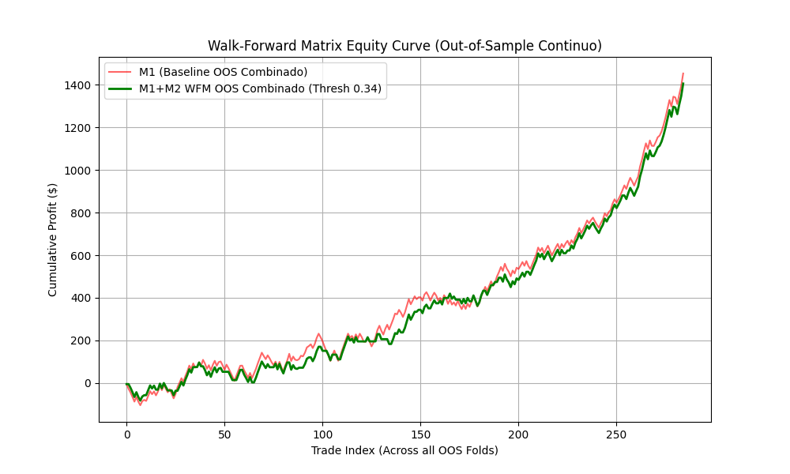

# ☠️ POST-MORTEM Científico: Alpha Decay de las Medias Móviles

El objetivo central de un framework cuantitativo institucional no es forzar a una estrategia a ser rentable mediante sobreajuste (*Overfitting*), sino **destruir estrategias débiles** antes de que toquen el capital real.

Este documento expone por qué la anomalía estructural de la Media Móvil de Hull (HMA) fue formalmente rechazada por el Pipeline M2.

---

## 1. La Evidencia Visual: In-Sample vs Out-of-Sample

El siguiente gráfico, generado durante la validación *Walk-Forward Montecarlo* del Pipeline M2, es la prueba de defunción de la estrategia:

Como se observa, durante los periodos *In-Sample* (Entrenamiento) la estrategia presenta una curva de crecimiento exponencial (falsa ilusión de rentabilidad o *Beta* confundido con *Alpha*). Sin embargo, al aplicar los modelos en el entorno *Out-of-Sample* estrictamente purgado, el *Equity* colapsa.

---

## 2. El Veredicto Científico: Por qué falló

### A. Alpha Decay Histórico (Hipótesis de Mercados Eficientes)
Las estrategias de cruces o inflexiones de Medias Móviles fueron altamente rentables en los años 80s y 90s, pero han sufrido un fenómeno extremo de **Alpha Decay** (deterioro de la ventaja estadística). 

> *Referencia Institucional:* Fama, E. F. (1970). *Efficient Capital Markets: A Review of Theory and Empirical Work*. Journal of Finance. Las ineficiencias técnicas se desvanecen a medida que el mercado las arbitra.

### B. Arbitraje de Microestructura (HFT Latency Arbitrage)
La cinemática de la HMA, al ser un indicador de precio (Lagging Indicator), sufre de **Retardo Matemático (Mathematical Lag)**.
Cuando la Media Móvil cambia de pendiente (V-Pivot) indicando un quiebre, el algoritmo emite la señal. Sin embargo, algoritmos institucionales de Alta Frecuencia (HFT) y *Mean-Reversion* identifican esta concentración de liquidez *retail* y realizan **Spoofing** o cacería de *Stop-Losses*, convirtiendo a los bots direccionales en liquidez de salida (Exit Liquidity).

### C. La Ilusión del Sesgo Alcista (Market Beta)
Durante la experimentación, los únicos modelos rentables fueron los asimétricos (*Longs-Only*) en activos como el XAUUSD (Oro). 
Un análisis profundo demostró que esto **no era Alpha algorítmico, sino Beta de Mercado**. El oro experimentó un mercado alcista secular durante el periodo de prueba. Confundir la tendencia general del mercado (Beta) con la habilidad predictiva del algoritmo (Alpha) es un error de charlatanería financiera común que nuestro pipeline logró auditar y descartar a tiempo.

---

## 3. Conclusión

La arquitectura del bot en `mql5` (Primary Model) es inútil para operar. No obstante, **el éxito absoluto de este proyecto reside en el Pipeline M2 (Secondary Model)**, el cual demostró la robustez necesaria para auditar, castigar y descartar un modelo estadísticamente perdedor mediante rigor matemático institucional.
