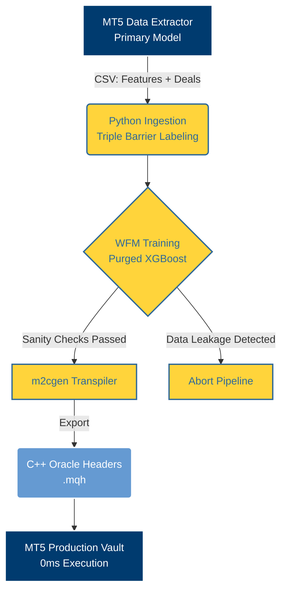

# M2 Quant Pipeline: Meta-Labeling Framework


> **Veredicto Científico:** Este repositorio fue creado para probar el *Edge* de la estrategia Hull Moving Average (HMA). Las rigurosas pruebas de este pipeline demostraron que **las Medias Móviles sufren de *Alpha Decay* irreversible y no funcionan como gatillos de entrada en Forex**. Se documenta el fracaso de la HMA para evitar pérdidas de capital.

Aunque la estrategia HMA murió, **la infraestructura construida aquí sobrevivió**. Este repositorio es un plano maestro institucional (Blueprint) que demuestra cómo construir, validar y desplegar modelos de *Machine Learning* en MetaTrader 5 a latencia cero.

---

## Arquitectura Core (M2 Pipeline)



---

## Mapa del Repositorio

El repositorio está estrictamente dividido en dos ecosistemas y una bóveda documental:

- **`/python/m2_metalabeling/`**: El motor estadístico y de Machine Learning (Ingesta, WFM, Transpilación).
- **`/mql5/`**: Código fuente de MetaTrader 5 (Extractores masivos de datos y Bóvedas de Producción C++).
- **`/docs/`**: Documentación Científica (Metodología, Evolución y Post-Mortem).

---

## Guía de Trabajo: Flujo de Ejecución (Panel CLI)

Para evitar ejecutar scripts sueltos, el repositorio cuenta con un orquestador interactivo que centraliza todas las operaciones algorítmicas de forma secuencial:

```bash
cd python
python main.py
```

Al ejecutarlo, se desplegará el panel de control institucional:

```text
============================================================
    M2 QUANT PIPELINE - INSTITUTIONAL CONTROL PANEL     
============================================================
 Basado en Marcos López de Prado (Advances in Financial ML)
 Framework de latencia cero para MetaTrader 5
============================================================

[ FLUJO DE EJECUCIÓN (WORKFLOW) ]
  1. Ingestar Datos y Aplicar Triple-Barrera (Meta-Labeling)
  2. Entrenar Modelos (Purged Walk-Forward Montecarlo)
  3. Auditoría Estricta contra Fuga de Datos (Sanity Check)
  4. Transpilar Oráculo a C++ (MQL5 0ms Latency)
  5. Ejecutar Flujo Completo (Portfolio Auto-Batch)
```

Este pipeline interactivo es completamente agnóstico y puede replicarse para auditar cualquier otra estrategia base (reemplazando los extractores en MQL5).

---

*Para continuar explorando la infraestructura matemática, proceda a la sección de [Metodología Cuantitativa](METHODOLOGY.md).*
