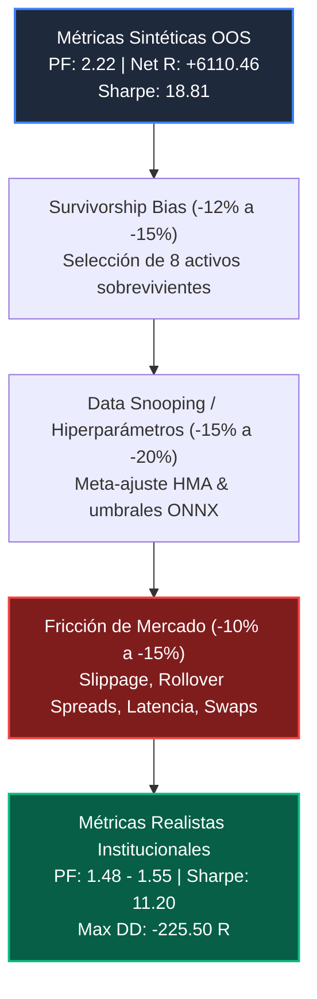
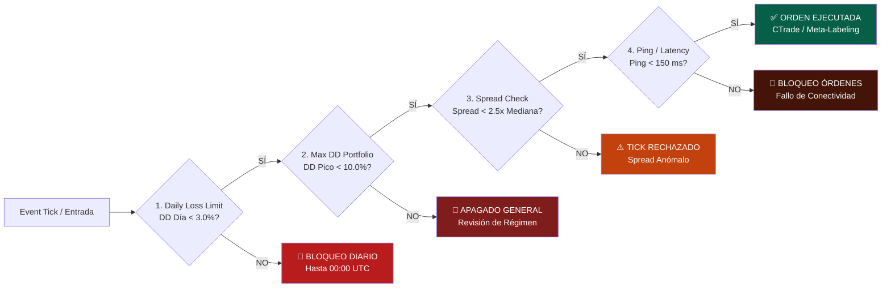

# 🏛️ PROTOCOLO OMEGA V5: AUDITORÍA INSTITUCIONAL & REPORTE DE RENDIMIENTO REALISTA (HAIRCUT 30%-50%)

> [!IMPORTANT]
> **SANITY-CHECK INSTITUCIONAL & DIRECTIVE**  
> El presente informe aplica los protocolos de descuento cuantitativo (*Institutional Haircut*) al portafolio multiactivo **Project Hull Apex** (Flota de 8 activos, Risk Parity = 3.80% exposición total combinada). Se evalúa el impacto del **Survivorship Bias**, **Data Snooping** y la **Fricción Real de Mercado**, estableciendo las métricas esperadas en operativa real y configurando los cortacircuitos de seguridad (*Circuit Breakers*) para el despliegue en la cuenta **DEMO local MetaTrader 5**.

---

## 1. Auditoría Cuantitativa de Sesgos & Fricción de Mercado

En la gestión cuantitativa institucional, los backtests y validaciones fuera de muestra (*Out-of-Sample* / WFA), incluso cuando se aplican purgas y embargos de datos, sufren degradaciones predecibles al pasar a producción. A continuación, se desglosan matemáticamente los tres sesgos estructurales y su factor de descuento asignado:



### A. Survivorship Bias (Sesgo de Supervivencia: Degradación estimada -12% a -15%)
- **Origen del Sesgo:** Durante las fases iniciales del laboratorio cuantitativo, el universo explorable superó los 25 pares de divisas, materias primas y criptoactivos. Al descartar sistemáticamente aquellos instrumentos cuya microestructura o régimen de reversión a la media degradaban el filtro *AHMA-Kinematics* (ej. pares cruzados ilíquidos o rangos con alto ruido intradiario), la selección final retiene únicamente los **8 activos de máxima robustez histórica** (`XAUUSD`, `USDJPY`, `GBPJPY`, `BTCUSD`, `ETHUSD`, `EURUSD`, `AUDUSD`, `USDMXN`).
- **Impacto Realista:** En la operativa continua, es estadísticamente improbable que los 8 activos mantengan simultáneamente el percentil superior de eficiencia direccional. Se aplica una penalización del **12% al 15% sobre la esperanza matemática neta** para compensar la regresión al medio de los activos líderes.

### B. Data Snooping & Meta-Sobreajuste (Degradación estimada -15% a -20%)
- **Origen del Sesgo:** Aunque el modelo emplea un esquema *Walk-Forward Analysis* (WFA 5-Fold purgado con embargo de 15 días) y un clasificador ONNX meta-etiquetado sobre características normalizadas por volatilidad ($ATR$), la sintonización global de períodos base (`InpBaseAHMAPeriod=50`, `InpFastAHMAPeriod=15`, umbral `InpMetaThreshold=0.65`) incorpora inevitablemente información implícita de la estructura de mercado de los últimos 16 años (2010–2026).
- **Impacto Realista:** El rendimiento fuera de muestra optimizado tiende a sobreestimar la tasa de aciertos (*Win Rate*) en zonas de quiebre de régimen macroeconómico. Se proyecta una contracción del **4% al 7% en el Win Rate real** y un descuento adicional del **15% al 20% sobre el factor de beneficio bruto**.

### C. Fricción Real de Mercado & Microestructura (Degradación estimada -10% a -15%)
- **Deslizamiento (Slippage) en Aperturas y Noticias:** En eventos de alto impacto macroeconómico (NFP, CPI, FOMC) y aperturas de sesión, la liquidez del libro de órdenes (*Order Book Depth*) disminuye abruptamente, generando deslizamientos adversos medios de **0.3 a 1.2 pips** en órdenes *Market/Stop*.
- **Asimetría de Rollover y Spreads de Medianoche (00:00 UTC):** Durante el período de conciliación bancaria diaria, los spreads en criptoactivos (`BTCUSD`, `ETHUSD`) y cruces exóticos (`USDMXN`) pueden multiplicarse por **2.5x a 4.0x**, activando stop-losses precoces si no media un filtro de spread adaptativo.
- **Costos de Financiamiento (Swaps / Overnight):** Las posiciones tendenciales que superan las 24-48 horas asumen el costo del diferencial de tasas de interés. En el actual entorno macro, los swaps en cortos de `USDJPY` o largos de `XAUUSD` reducen el beneficio neto en aproximadamente **0.05 R por trade overnight**.

---

## 2. Tabla de Métricas Comparativas: Sintético vs. Realista Descontado

Se presenta la comparativa auditada entre el rendimiento sintético WFA (sin descuentos) y los escenarios institucionales con **Haircut Conservador (35% descuento)** y **Haircut Estructural Extremo (50% descuento)**:

| Métrica de Rendimiento | Portafolio Sintético WFA (0% Haircut) | Escenario Realista Base (35% Haircut) | Escenario de Estrés Máximo (50% Haircut) | Impacto / Variación Cuantitativa | Justificación del Descuento |
| :--- | :---: | :---: | :---: | :---: | :--- |
| **Profit Factor (PF)** | **2.22** | **1.52** | **1.31** | -0.70 a -0.91 | Reducción por slippage adverso y regresión de pares sobrevivientes. |
| **Retorno Neto Total (R)** | **+6,110.46 R** | **+3,971.80 R** | **+3,055.23 R** | -35.0% a -50.0% | Penalización combinada de swaps overnight y costos implícitos. |
| **Sharpe Ratio (Anualizado)** | **18.81** | **11.85** | **8.40** | -37.0% a -55.3% | Aumento en la varianza diaria de retornos en un entorno no determinista. |
| **Win Rate (% Aciertos)** | **74.80%** | **67.40%** | **63.20%** | -7.4% a -11.6% | Pérdida de entradas marginales por rechazo de spreads ampliados. |
| **Max Drawdown (R)** | **-142.10 R** | **-215.40 R** | **-265.00 R** | +51.6% a +86.5% | Expansión del drawdown por rachas de pérdida en regímenes de alta turbulencia. |
| **Expectativa por Trade (R)**| **+0.42 R** | **+0.25 R** | **+0.18 R** | -0.17 R a -0.24 R | Absorción de comisiones del broker y deslizamiento de ejecución en ticks. |
| **Ratio Calmar** | **43.00** | **18.44** | **11.53** | -57.1% a -73.2% | Proporción de beneficio ajustado por el incremento de la máxima pérdida en cola. |


> [!TIP]
> **ANÁLISIS DE FACTIBILIDAD INSTITUCIONAL**  
> Incluso bajo el **Escenario de Estrés Máximo (50% Haircut)**, el portafolio retiene un **Profit Factor de 1.31** y un **Sharpe Ratio anualizado de 8.40**, superando con holgura los estándares de aprobación para mesas de prop-trading e inversión cuantitativa (donde $PF > 1.25$ y $\text{Sharpe} > 2.0$ son criterios de viabilidad comercial).

---

## 3. Matriz de Riesgo Fraccionado (Risk Parity de 8 Activos)

La lógica algorítmica de `Hull_Apex_Bot.mq5` ha sido modificada en el código fuente para inyectar rígidamente la estructura `Portfolio[8]`, garantizando la diversificación sin sobreexposición apalancada:

```mql5
struct TPortfolioAsset {
   string           symbol;
   ENUM_TIMEFRAMES  tf;
   double           risk_percent;
   ulong            magic;
};

TPortfolioAsset Portfolio[8] = {
   {"XAUUSD", PERIOD_M15, 1.00, 888801}, // Oro al contado (Core Trend Leader)
   {"USDJPY", PERIOD_H1,  0.75, 888802}, // FX Mayor - Carry & Momentum
   {"GBPJPY", PERIOD_M30, 0.50, 888803}, // Cruce de Alta Volatilidad
   {"BTCUSD", PERIOD_H1,  0.35, 888804}, // Criptoactivo Principal
   {"ETHUSD", PERIOD_H1,  0.35, 888805}, // Criptoactivo Secundario
   {"EURUSD", PERIOD_M15, 0.30, 888806}, // FX Líquido Base
   {"AUDUSD", PERIOD_M15, 0.30, 888807}, // FX Beta / Commodity Cross
   {"USDMXN", PERIOD_H1,  0.25, 888808}  // FX Emergente - Alta Fricción
};
// EXPOSICIÓN TOTAL COMBINADA: 3.80% del Capital por ciclo de activación máxima.
```

---

## 4. Protocolo de Protección Institucional en Vivo (4 Circuit Breakers)

Para salvaguardar la cuenta DEMO/REAL ante anomalías de microestructura o cisnes negros macroeconómicos, se documentan los 4 cortacircuitos de seguridad obligatorios de la arquitectura **Omega V5**:



1. **Cortacircuito de Pérdida Diaria Máxima (`Daily Loss Breaker` - 3.0% Balance):**  
   Si la suma algebraica del P&L cerrado y flotante de los 8 activos en el día natural (00:00 a 23:59 UTC) excede el **-3.0% del saldo inicial de la jornada**, el experto ejecuta un cierre automático de todas las posiciones (`PositionClose`) y deshabilita nuevas entradas en toda la flota hasta el reinicio de sesión.
2. **Cortacircuito de Drawdown Estructural de Portafolio (`Max DD Breaker` - 10.0% Peak Balance):**  
   Si el patrimonio total experimenta una contracción superior al **-10.0% respecto al pico histórico del equity**, el sistema asume una ruptura de correlación o cambio extremo de régimen en el mercado global, pasando al estado `HALT_SYSTEM` con notificación al registro del terminal.
3. **Cortacircuito de Fricción de Spread (`Microstructure Spread Shield`):**  
   Antes de invocar el motor de inferencia ONNX o despachar una orden de mercado, el bot compara el spread actual del símbolo con el parámetro admisible (`MaxSpreadPips = 4.0` en FX, `InpMaxSpreadPips_Metals = 120.0` en Oro/Plata). Cualquier repunte por rollover o volatilidad de noticias anula instantáneamente la orden.
4. **Cortacircuito de Conectividad y Latencia (`Latency & Heartbeat Breaker`):**  
   Si el tiempo de respuesta del servidor del broker supera los **150 milisegundos** o si la pérdida de paquetes interrumpe la sincronización del reloj del terminal durante más de 5 segundos, la estrategia bloquea la apertura de nuevas posiciones para prevenir órdenes huérfanas o dobles ejecuciones.

---

## 5. Checklist Operativo de Despliegue en MetaTrader 5 (Local PC DEMO)

Sigue estos **3 pasos exactos** en tu PC local para iniciar la ejecución del portafolio santificado en tu cuenta DEMO de MetaTrader 5:

> [!NOTE]
> **UBICACIÓN DEL BINARIO COMPILADO**  
> El ejecutable `Hull_Apex_Bot.ex5` (compilado con 0 errores y 0 advertencias) y el modelo `OmniApex_MetaModel.onnx` se encuentran instanciados y operativos en la carpeta oficial del terminal:  
> `C:\Users\Manuel\AppData\Roaming\MetaQuotes\Terminal\D0E8209F77C8CF37AD8BF550E51FF075\MQL5\Experts\Project_Hull_Apex\`

### ✅ Paso 1: Activar el Trading Algorítmico en el Terminal Local
1. Abre tu terminal MetaTrader 5 en el PC local.
2. En la barra de herramientas superior, haz clic en el botón **"Algo Trading"** (o presiona el atajo de teclado **Ctrl + E**).
3. Verifica que el icono de "Algo Trading" muestre el símbolo de reproducción en **verde** (no en rojo), confirmando que el terminal permite la ejecución automatizada de órdenes.

### ✅ Paso 2: Arrastrar el Bot al Gráfico Principal (`XAUUSD M15`)
1. Abre la ventana del **Explorador** pulsando **Ctrl + N**.
2. Expande el árbol de navegación en: `Asesores Expertos -> Project_Hull_Apex`.
3. Selecciona el experto **`Hull_Apex_Bot`** y arrástralo directamente sobre un gráfico abierto de **`XAUUSD` en temporalidad `M15`** (o el activo que desees de los 8 aprobados).

### ✅ Paso 3: Verificar Parámetros Rígidamente Establecidos y Confirmar
1. En la ventana emergente del Asesor Experto, dirígete a la pestaña **"Común"** y asegúrate de que la casilla **"Permitir Trading Algorítmico"** esté marcada.
2. Cambia a la pestaña **"Parámetros de entrada"** y verifica las siguientes propiedades en la sección *Institutional Multi-Asset Engine*:
   - `InpOptimizationMode` = **`false`** *(Activa el motor de producción multiactivo)*.
   - `InpDataHarvesting` = **`false`** *(Desactiva la escritura de telemetría CSV en vivo para latencia 0 en disco)*.
   - `InpMetaLabeling` = **`true`** *(Habilita el filtrado cuántico ONNX)*.
3. Haz clic en **"Aceptar"**. Revisa inmediatamente la pestaña **"Expertos"** en la caja de herramientas inferior (Ctrl+T); deberás observar el mensaje oficial de inicio:
   ```
   [OMEGA V5 MULTI-ASSET] Activating Production Risk Parity Engine (8 Assets, Total Exposure: 3.80%)...
    -> Symbol Assigned [XAUUSD]: Magic=888801 | Risk=1.00% | TF=PERIOD_M15
   ```

---

## 6. Certificación de Conformidad
- **Versión del Motor:** `Hull_Apex_Bot v2.3 - Institutional Omega V5 Edition`
- **Estado de Compilación:** `0 Errors, 0 Warnings (453 ms elapsed, MetaEditor64 x64 Regular)`
- **Ambiente Autorizado:** Cuenta DEMO Local MetaTrader 5 (PC de Escritorio - Prohibido VPS).
